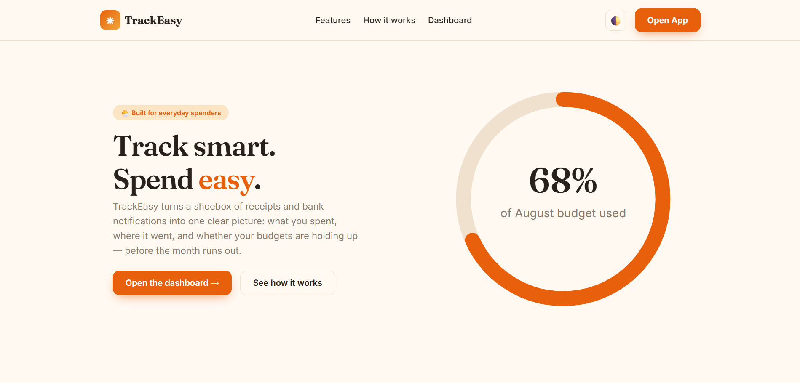
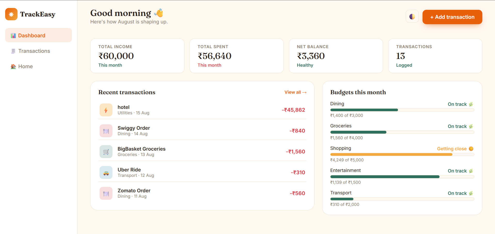
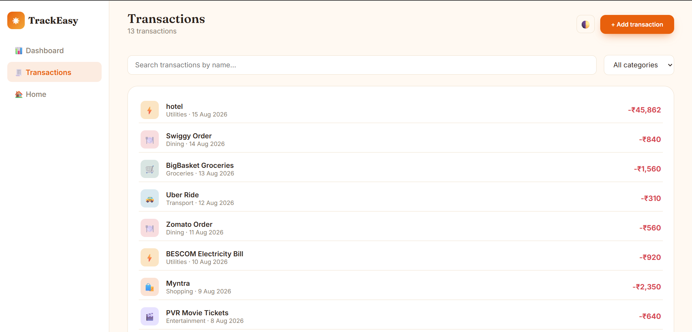

# TrackEasy — Smart Expense Tracker

A small expense-tracking web app built with **plain HTML, CSS, and JavaScript**
(no frameworks, no build step), plus a **Python** script and **SQL** schema
that show the same data being processed and queried the way a real backend
would. Built as a portfolio project to demonstrate fundamentals rather than
framework familiarity.

🔗 **Live demo:** [https://anvitac7.github.io/trackeasy-expense-tracker/](#)

## Screenshots

| Landing | Dashboard | Transactions |
|---|---|---|
|  |  |  |

## Why it's built this way

Most tutorial expense trackers reach for a framework immediately. This one
deliberately doesn't: the goal was to show HTML/CSS/JS fundamentals — semantic
markup, hand-written responsive CSS with custom properties, and vanilla DOM
manipulation — clearly enough that none of it is hidden behind a library.

The Python and SQL folders exist because a real product team doesn't stop at
the frontend: `python/expense_analyzer.py` processes the same transaction
data the UI shows, and `sql/` defines how it'd actually be modeled and queried
in a database, including the budget-status logic mirrored from `dashboard.js`
so the numbers agree everywhere.

## Project structure

```
trackeasy/
├── index.html              # Landing page
├── dashboard.html           # Overview: stats, budgets, recent transactions
├── transactions.html        # Full list with search/filter + add-transaction form
├── css/
│   └── style.css            # Hand-written CSS, design tokens as custom properties
├── js/
│   ├── main.js               # Dark mode, mobile nav, toast helper, shared utils
│   ├── store.js               # In-browser data layer (seed data + localStorage)
│   ├── dashboard.js            # Renders dashboard.html from Store
│   └── transactions.js          # Renders transactions.html, search/filter, form validation
├── data/
│   ├── transactions.json     # Sample data (also used by the Python script)
│   └── budgets.json
├── python/
│   └── expense_analyzer.py   # Standalone data processing script (stdlib only)
├── sql/
│   ├── schema.sql             # Table design (SQLite syntax, portable to Postgres/MySQL)
│   └── queries.sql            # 5 annotated analytical queries
├── screenshots/              # README images
└── README.md
```

## Running it

**Frontend** — no install needed, it's static files:
```
open index.html
```
or, for the fetch-friendly version of local dev, serve it:
```
python3 -m http.server 8000
```

**Python script:**
```
cd python
python3 expense_analyzer.py                 # prints a report
python3 expense_analyzer.py --export out.csv  # also exports a CSV for Tableau/Power BI
```

**SQL:**
```
sqlite3 trackeasy.db < sql/schema.sql
sqlite3 trackeasy.db < sql/queries.sql
```

## Design decisions

- **Budgets turn amber at 80% and red at 95%**, not just at 100%. The idea is
  to warn before someone overspends, not report it after the fact — a small
  product decision that matters more than the visual polish around it.
- **Data lives in `localStorage`**, not a backend, so the app is fully usable
  with zero setup for anyone reviewing it. `js/store.js` is written so that
  swapping `localStorage` calls for `fetch()` calls to a real API would only
  touch that one file.
- **No CSS framework.** Colors, spacing, and type scale are defined once as
  CSS custom properties in `:root` (`css/style.css`) so the whole visual
  language can be changed from one place.

## Security notes

Basic hygiene, appropriate for an intern-level project rather than a claim of
security expertise:
- User-supplied text (transaction names, etc.) is passed through
  `escapeHTML()` before being inserted into the DOM, to avoid naive
  script-injection via innerHTML.
- The SQL schema stores `password_hash`, never a plaintext password column,
  even though this project has no live auth backend yet.
- Form inputs are validated both by HTML5 attributes (`type="number"`,
  `min`) and in JavaScript before being accepted, rather than trusting the
  browser alone.

## What I'd build next

- A real backend (FastAPI, matching the Python already in this repo) so
  `store.js` talks to an actual API instead of `localStorage`.
- Recurring transactions and monthly budget rollover.
- Category-level charts on the dashboard (currently text/number based).

## AI tools used

I used Claude to help scaffold the CSS design tokens and debug a couple of
layout issues, and to sanity-check the SQL queries. All logic — the
validation rules, the budget-threshold decisions, the data layer design —
was written and reviewed by me.
